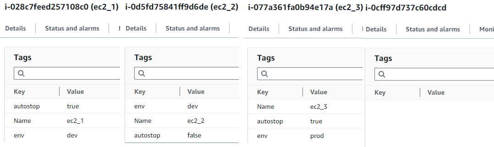

# Automated Instance Management with AWS Lambda and DynamoDB

## Introduction
At times, individuals inadvertently leave their instances running overnight, resulting in unnecessary costs. This is a common challenge in the working world, where developers may deploy instances without remembering to shut them down or in anticipation of future use, leading to unnecessary expenses. Therefore, implementing an automated system to halt instances overnight and restart them in the morning would be advantageous. Rather than terminating instances, it's preferable to stop them, as developers may need their resources for ongoing projects or for the next day's work. In cases where developers require their resources to run at night, they can utilize alternatives such as setting tags to ensure that automation doesn't stop their instance.

In this project, I will utilize EventBridge to trigger an AWS Lambda function to stop instances at a specific time (e.g., 10 p.m.). The information about the stopped instances will be stored in a DynamoDB database. At another specific time (e.g., 8 a.m.), the AWS Lambda function will be triggered to retrieve this information from DynamoDB and bring up the instances.

## Prerequisites
Before getting started, ensure that the following prerequisites are in place:
1. AWS CLI configured with your AWS account credentials.
2. A text editor (e.g. Visual Studio Code).
3. Terraform installed

## Configuration Files
1. **provider.tf**: This file contains the provider definition (AWS) and the region(us-east-1) for the resource setup.

2. **cloudwatch_event.tf**: This file contains the configuration code that will trigger the Lambda functions at specified times.

3. **lambda.tf**: This file contains the configuration code to deploy two separate Lambda functions: one to stop the instances and another to start them. IAM policies are also attached to the Lambda functions to grant them access to the instances, DynamoDB, and to create logs.

4. **dynamodb.tf**: This file contains the configuration code to deploy a DynamoDB to store the stopped instance information.

5. **variables.tf**: Consist of timing to trigger the Lambda to start and stop the instances.

6. **stop_instances_lambda.py**: The AWS Lambda Python script will iterate through all regions to identify running instances. It will selectively stop instances that are in the 'dev' environment and lack the 'autostop' tag.

7. **start_instances_lambda.py**: The AWS Lambda Python script will retrieve information about stopped instances from DynamoDB and start up all the instances once the Lambda is triggered.

## Getting Started

### Dummy EC2 instances

I have created four EC2 instances for testing this project, each with different tags.

Instances  | Tags
------------- | -------------
1st instance  | 'Name'= 'ec2_1', 'env'= 'dev','autostop'= 'true'
2nd instance  | 'Name'= 'ec2_2', 'env'= 'dev','autostop'= 'false'
3rd instance  | 'Name'= 'ec2_3', 'env'= 'prod','autostop'= 'true'
4th instance  | No tags




### Cloning from the repository

Open Git Bash and change the current working directory to the location where you want the cloned directory to be.
```
cd '/c/Users/YOUR USERNAME HERE/YOUR FOLDER HERE'
git clone https://LINKFROMGITHUB
```

### Deploying the resources using terraform

```
terraform init  # Intialises provider plugin and modules
terraform plan  # Create the execution plan for the code
terraform apply # Creates the resources
```

### AWS Resources Deployed

Go to the AWS console, and it should show the following: 

**Lambda**


**EventBridge Trigger**

Each lambda is linked to the EventBridge Trigger


**DynamoDB**


## Results

For this project, I've configured the lambda function to trigger at short intervals for testing purposes. Specifically, it triggers at 3:10pm (UTC) in my case. When triggered, the lambda's activity can be observed in the CloudWatch logs.


I've configured the lambda to stop instances labeled under 'dev' unless they explicitly opt-out of shutdown automation by including the 'autostop": true' tag. Additionally, instances without any tags will also be stopped.

For this project, the lambda stopped two instances: Instance 1, which had the 'dev' tag and 'true' under autostop, and Instance 4, which had no tags.

For instance 3, I deliberately included an 'autostop": true' tag, even though the instance is labeled as 'proc'. This is a test scenario to verify that the lambda only stops instances labeled as 'dev'.


The lambda also stored the data of the stopped instances in DynamoDB. We'll need this information when starting up the instances.


At the specified start instance timing, 3:20pm (UTC) for this project, the lambda is triggered, and the activity can be observed in the CloudWatch logs.


The lambda retrieved the stopped instance data from DynamoDB and started up the instances that were previously stopped.


## Deleting 

Remember to delete all the AWS resources after you are done.
```
# Remove all the resources using terraform destroy
terraform destroy 
```